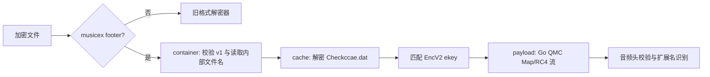

# unlock-music-go

用 Go 编写的命令行音乐文件解密工具，支持网易云、QQ 音乐、酷狗、酷我、喜马拉雅与咪咕的常见加密格式；也支持为 MP3、FLAC、OGG 写入或读取 LRC 歌词标签。

## 当前状态

- 旧版格式和通用 QMC 流均为纯 Go 实现，`amd64`、`386` 均可构建。
- 新版 QQ Music desktop `musicex`：容器解析、`Checkccae.dat` 解密、EncV2 ekey 匹配、QMC Map/RC4 音频流解密均已在 Go 中实现。
- `musicex` 自动读取本机 MMKV device key 的最后一环仍调用 QQ Music 的 32 位 `CommonFunction.dll`（ordinal 12）。因此，**现阶段完整自动解密新版 `musicex` 请使用 Windows `386` 构建**；`amd64` 会完成容器识别后在该步骤给出明确报错。

## 支持格式

| 平台 | 扩展名 |
|---|---|
| 网易云音乐 | `.ncm`、`.uc` |
| QQ 音乐 QMC / musicex | `.mgg`、`.mgg0`、`.mggl`、`.mgg1`、`.mflac`、`.mflac0`、`.mmp4`、`.qmcflac`、`.qmcogg`、`.qmc0`、`.qmc2`、`.qmc3`、`.qmc4`、`.qmc6`、`.qmc8`、`.bkcmp3`、`.bkcm4a`、`.bkcflac`、`.bkcwav`、`.bkcape`、`.bkcogg`、`.bkcwma`、`.tkm`、`.cache`、`.666c6163`、`.6d7033`、`.6f6767`、`.6d3461`、`.776176` |
| QQ 音乐旧版 | `.tm2`、`.tm6` |
| 酷我音乐 | `.kwm` |
| 酷狗音乐 | `.kgm`、`.kgma`、`.vpr` |
| 喜马拉雅 | `.xm`、`.x2m`、`.x3m` |
| 咪咕音乐 | `.mg3d` |

输出格式由解密后的音频头自动识别，通常为 MP3、FLAC、OGG、M4A、WAV 或 APE。

## 新版 QQ Music `musicex`

文件尾部固定保留一个 16 字节 footer：

```text
0x00..0x03  uint32 LE  footer length
0x04..0x07  uint32 LE  version（当前支持 1）
0x08..0x0F  ASCII      "musicex\\0"
```

`musicex` 文件不会降级走旧 QMC 路径：检测到 footer magic 后，程序先校验 `version=1`、footer 长度和内嵌 UTF-16LE 文件名。这样未来出现新版本时，失败位置会保留在版本校验或后续密钥环节，而不会产出误导性的旧算法结果。

### 解密链路



| `musicex` 环节 | Windows amd64 | Windows 386 |
|---|---:|---:|
| footer / version / 内部文件名校验 | ✓ | ✓ |
| `Checkccae.dat` AES-CFB 与 ekey 匹配 | ✓ | ✓ |
| QMC Map/RC4 payload 流解密 | ✓（纯 Go） | ✓（纯 Go） |
| 自动生成本机 MMKV device key | 依赖 32 位 DLL，当前在此结束 | ✓ |
| 完整本机 `musicex` 解密 | 当前未完成 | ✓ |

默认会查找：

- QQ Music：`%ProgramFiles(x86)%\Tencent\QQMusic\CommonFunction.dll`
- 下载 key 缓存：`%APPDATA%\Tencent\QQMusic\Checkccae.dat`

可通过 `-qqmusic-dir` 和 `-qqmusic-mmkv` 覆盖这两个位置。

## 构建

要求 Go 1.25+。

```powershell
git clone <仓库地址>
Set-Location unlock-music-go
go test ./...
```

### 常规 / amd64 构建

适用于全部旧格式，也可验证 `musicex` 容器、缓存和纯 Go payload 模块。

```powershell
$env:GOOS = 'windows'
$env:GOARCH = 'amd64'
go build -o .\unlock-amd64.exe .
```

### 新版 `musicex` 完整解密构建

当前自动 device key 读取进入 QQ Music 32 位 DLL，使用 x86 构建：

```powershell
$env:GOOS = 'windows'
$env:GOARCH = '386'
go build -o .\unlock-386.exe .
```

## 使用

```text
unlock-music-go -i <文件或目录> [-o <输出目录>] [-with-lyrics] [-lrc-pattern <正则>]
unlock-music-go -i <文件或目录> -embed-lyrics [-o <输出目录>] [-lrc-pattern <正则>]
unlock-music-go -i <文件.mp3|flac|ogg> -dump-tags
```

| 参数 | 默认值 | 说明 |
|---|---|---|
| `-i` | 必填 | 输入文件或目录；目录递归处理 |
| `-o` | 源文件同目录 | 输出目录；批量任务保留子目录结构 |
| `-with-lyrics` | `false` | 解密后查找同目录 LRC 并写入标签 |
| `-embed-lyrics` | `false` | 仅给已有 MP3 / FLAC / OGG 写入歌词 |
| `-dump-tags` | `false` | 打印 MP3 / FLAC / OGG 内嵌歌词并退出 |
| `-lrc-pattern` | `{name}\.lrc` | 歌词正则模板，`{name}` 代表已转义的歌曲文件名 |
| `-qqmusic-dir` | 自动查找 | QQ Music 安装目录，仅 `musicex` 使用 |
| `-qqmusic-mmkv` | `%APPDATA%\Tencent\QQMusic\Checkccae.dat` | QQ Music key 缓存，仅 `musicex` 使用 |

```powershell
# 单文件
.\unlock-386.exe -i 'D:\Music\song.mflac'

# 递归批量解密并输出到单独目录
.\unlock-386.exe -i 'D:\Music' -o 'D:\Decoded'

# 解密时写入同目录匹配到的 LRC
.\unlock-386.exe -i 'D:\Music' -o 'D:\Decoded' -with-lyrics

# 使用非默认 QQ Music 路径
.\unlock-386.exe -i 'D:\Music\song.mflac' `
  -qqmusic-dir 'D:\Apps\QQMusic' `
  -qqmusic-mmkv 'D:\QQMusicData\Checkccae.dat'

# 仅为明文文件写入歌词；未给 -o 时会覆盖源文件
.\unlock-386.exe -i 'D:\Music' -embed-lyrics -o 'D:\Tagged'

# 查看已经写入的歌词
.\unlock-386.exe -i 'D:\Tagged\song.flac' -dump-tags
```

### 歌词规则与标签

`-lrc-pattern` 是不区分大小写的 Go 正则模板；`{name}` 替换为歌曲名。多个宽松匹配结果且不存在精确 `歌曲名.lrc` 时，该文件会跳过，避免误写其他版本歌词。

| 音频格式 | 写入位置 |
|---|---|
| MP3 | ID3v2.3 `USLT` |
| FLAC / OGG | Vorbis Comment `LYRICS` |

歌词输入自动识别 UTF-8、UTF-16 LE/BE、GBK、GB18030。NCM 解密得到的封面会写入 MP3（`APIC`）、FLAC（`PICTURE`）、OGG（`METADATA_BLOCK_PICTURE`）。

## 项目架构

```text
unlock-music-go/
├── main.go                 # flag 解析与三种运行模式入口
├── run_modes.go            # 单文件 / 批量解密、歌词嵌入流程
├── decrypt_dispatch.go     # 扩展名分发；musicex 优先于旧 QMC
├── files.go                # 遍历、歌词查找、输出路径
├── output.go               # 进度与汇总显示
├── encoding.go             # LRC 文本编码识别
├── types.go                # 任务与扩展名集合
├── usage.go                # CLI 帮助
└── decrypt/
    ├── musicex.go           # 新版 musicex 编排：container → cache → payload
    ├── musicex_container.go # footer、version、UTF-16LE 内部文件名
    ├── musicex_cache.go     # 安装/缓存定位、AES-CFB、ekey 匹配
    ├── musicex_payload.go   # 纯 Go QMC Map/RC4 payload 解密与音频头校验
    ├── mmkv_device_windows_386.go # Windows/x86 的 CommonFunction ordinal 12
    ├── mmkv_device_stub.go  # 其他构建目标的明确状态返回
    ├── qmc.go / qmc_key.go / qmc_cipher.go # QQ QMC 与密钥派生
    ├── ncm*.go              # 网易云解密与缓存
    ├── kgm.go / kwm.go / tm.go / xm.go / ximalaya.go / mg3d.go
    ├── lyrics.go / tags_read.go / cover.go
    └── *_test.go             # 格式、密码流、标签和 musicex 单元测试
```

顶层 `main` 包仅负责 CLI 与文件任务，`decrypt` 包只负责字节级容器、密码和标签处理。`musicex` 再按容器、缓存、payload 三层拆分，便于独立测试版本识别、MMKV 记录匹配与流解密。

## 验证

```powershell
# 默认架构测试
go test ./...

# x86 测试（含 build-tag 覆盖）
$env:GOARCH = '386'
go test ./...

# 64 位构建与当前 musicex 端到端状态检查
$env:GOARCH = 'amd64'
go build -o .\unlock-amd64.exe .
.\unlock-amd64.exe -i 'D:\Music\song.mflac' -o "$env:TEMP\unlock-amd64-check"
```

最后一条在当前版本会识别 `musicex` 并在生成 MMKV device key 的 32 位 DLL 边界结束；`386` 可执行文件走同一条容器、缓存和纯 Go payload 链路并完成输出。批量处理时每个文件的成功或失败都会显示在 Summary 中；存在失败文件时进程返回码为 `1`。

## 依赖

唯一的第三方依赖是 `golang.org/x/text`，用于 GBK / GB18030 歌词解码。其余解密和标签逻辑均由项目自身代码实现。

## 声明

请遵守音乐平台的服务协议与适用规则，仅处理自己有权访问的文件。
