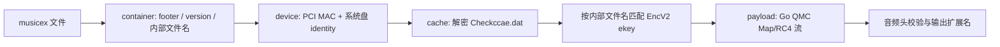

# unlock-music-go

Go 编写的命令行音乐文件解密工具，覆盖网易云、QQ 音乐、酷狗、酷我、喜马拉雅和咪咕的常见加密格式，并支持为 MP3、FLAC、OGG 写入或读取 LRC 歌词标签。

## 特性

- 支持 30+ 种加密文件扩展名。
- 支持 QQ Music desktop 当前 `musicex` 下载格式，完整链路为纯 Go。
- 新版 `musicex` 支持 Windows `amd64` 和 `386`；不加载 `CommonFunction.dll`，不依赖 QQ Music 安装目录。
- 自动读取本机 `%APPDATA%\Tencent\QQMusic\Checkccae.dat`，也支持 `-qqmusic-mmkv` 指定缓存文件。
- 解密时可匹配 LRC 并写入 MP3 `USLT`、FLAC / OGG `LYRICS` 标签。
- NCM 解密会将容器中的封面写回 MP3、FLAC、OGG 输出文件。
- 目录输入会递归处理并保留原始子目录结构；存在失败文件时进程返回码为 `1`。

## 支持格式

| 平台 | 扩展名 |
|---|---|
| 网易云音乐 | `.ncm`、`.uc` |
| QQ 音乐 QMC / musicex | `.mgg`、`.mgg0`、`.mggl`、`.mgg1`、`.mflac`、`.mflac0`、`.mmp4`、`.qmcflac`、`.qmcogg`、`.qmc0`、`.qmc2`、`.qmc3`、`.qmc4`、`.qmc6`、`.qmc8`、`.bkcmp3`、`.bkcm4a`、`.bkcflac`、`.bkcwav`、`.bkcape`、`.bkcogg`、`.bkcwma`、`.tkm`、`.cache`、`.666c6163`、`.6d7033`、`.6f6767`、`.6d3461`、`.776176` |
| QQ 音乐旧版 | `.tm2`、`.tm6` |
| 酷我音乐 | `.kwm` |
| 酷狗音乐 | `.kgm`、`.kgma`、`.vpr` |
| 喜马拉雅 | `.xm`、`.x2m`、`.x3m` |
| 咪咕音乐 | `.mg3d` |

输出扩展名由解密后的音频头自动识别，通常为 MP3、FLAC、OGG、M4A、WAV 或 APE。

## QQ Music `musicex`

当前 QQ Music desktop 下载文件在尾部带有 16 字节 footer：

```text
0x00..0x03  uint32 LE  footer length
0x04..0x07  uint32 LE  version（当前支持 1）
0x08..0x0F  ASCII      "musicex\\0"
```

检测到 footer magic 后，程序会校验 `version=1`、footer 长度及内嵌 UTF-16LE 文件名；新版本容器保持在版本校验路径中，不会进入旧 QMC 分支。

### 解密链路



| 环节 | Windows amd64 | Windows 386 |
|---|---:|---:|
| `musicex` footer / `version=1` 校验 | ✓ | ✓ |
| MMKV device key 推导 | ✓ | ✓ |
| `Checkccae.dat` AES-CFB 解密与 ekey 匹配 | ✓ | ✓ |
| QMC Map/RC4 payload 流解密 | ✓ | ✓ |
| QQ Music DLL / 安装目录 | 无需 | 无需 |

`Checkccae.dat` 保存下载记录中的 EncV2 ekey，且由下载机器的 device key 保护。自动读取模式使用该缓存对应的 Windows 机器硬件标识：PCI 网卡 MAC、系统盘序列号、型号、固件版本。缓存内须保留与目标文件内部名对应的记录。

默认缓存位置：

```text
%APPDATA%\Tencent\QQMusic\Checkccae.dat
```

非默认位置使用 `-qqmusic-mmkv` 指定。

## 构建

要求 Go 1.25+。

```powershell
git clone <仓库地址>
Set-Location unlock-music-go
go test ./...
```

### Windows x64

```powershell
$env:GOOS = 'windows'
$env:GOARCH = 'amd64'
go build -o .\unlock-amd64.exe .
```

### Windows x86

```powershell
$env:GOOS = 'windows'
$env:GOARCH = '386'
go build -o .\unlock-386.exe .
```

两种 Windows 构建使用同一套纯 Go `musicex`、MMKV、QMC 代码；x64 为默认推荐构建。

## 使用

```text
unlock-music-go -i <文件或目录> [-o <输出目录>] [-with-lyrics] [-lrc-pattern <正则>]
unlock-music-go -i <文件或目录> -embed-lyrics [-o <输出目录>] [-lrc-pattern <正则>]
unlock-music-go -i <文件.mp3|flac|ogg> -dump-tags
```

| 参数 | 默认值 | 说明 |
|---|---|---|
| `-i` | 必填 | 输入文件或目录；目录递归处理 |
| `-o` | 源文件同目录 | 输出目录；批量任务保留子目录结构 |
| `-with-lyrics` | `false` | 解密后查找同目录 LRC 并写入标签 |
| `-embed-lyrics` | `false` | 仅给已有 MP3 / FLAC / OGG 写入歌词 |
| `-dump-tags` | `false` | 打印 MP3 / FLAC / OGG 内嵌歌词并退出 |
| `-lrc-pattern` | `{name}\.lrc` | 歌词正则模板，`{name}` 代表已转义的歌曲文件名 |
| `-qqmusic-mmkv` | `%APPDATA%\Tencent\QQMusic\Checkccae.dat` | QQ Music 下载 ekey 缓存，仅 `musicex` 使用 |

```powershell
# 解密单个 musicex 文件
.\unlock-amd64.exe -i 'D:\Music\song.mflac'

# 递归批量解密
.\unlock-amd64.exe -i 'D:\Music' -o 'D:\Decoded'

# 指定非默认 Checkccae.dat
.\unlock-amd64.exe -i 'D:\Music\song.mflac' `
  -qqmusic-mmkv 'E:\QQMusicData\Checkccae.dat'

# 解密并写入同目录匹配到的歌词
.\unlock-amd64.exe -i 'D:\Music' -o 'D:\Decoded' -with-lyrics

# 给明文音频写入歌词；未给 -o 时覆盖源文件
.\unlock-amd64.exe -i 'D:\Music' -embed-lyrics -o 'D:\Tagged'

# 查看已写入的歌词
.\unlock-amd64.exe -i 'D:\Tagged\song.flac' -dump-tags
```

### 歌词规则与标签

`-lrc-pattern` 是不区分大小写的 Go 正则模板；`{name}` 替换为歌曲名。多个宽松匹配结果且不存在精确 `歌曲名.lrc` 时，该文件会跳过，避免误写其他版本歌词。

| 音频格式 | 写入位置 |
|---|---|
| MP3 | ID3v2.3 `USLT` |
| FLAC / OGG | Vorbis Comment `LYRICS` |

歌词输入自动识别 UTF-8、UTF-16 LE/BE、GBK、GB18030。NCM 解密得到的封面会写入 MP3（`APIC`）、FLAC（`PICTURE`）、OGG（`METADATA_BLOCK_PICTURE`）。

## 项目架构

```text
unlock-music-go/
├── main.go                 # flag 解析与运行模式入口
├── run_modes.go            # 单文件 / 批量解密、歌词嵌入流程
├── decrypt_dispatch.go     # 扩展名分发；musicex 优先于旧 QMC
├── files.go                # 遍历、歌词查找、输出路径
├── output.go               # 进度、汇总与进程状态
├── encoding.go             # LRC 文本编码识别
├── usage.go                # CLI 帮助
└── decrypt/
    ├── musicex.go           # 新版 musicex 编排
    ├── musicex_container.go # footer、版本、UTF-16LE 内部文件名
    ├── musicex_cache.go     # Checkccae.dat、AES-CFB、ekey 匹配
    ├── musicex_payload.go   # 纯 Go QMC Map/RC4 payload 解密
    ├── mmkv_device_windows.go # Windows 设备标识与 MMKV key 纯 Go 推导
    ├── mmkv_device_stub.go  # 非 Windows 构建提示
    ├── qmc.go / qmc_key.go / qmc_cipher.go # QQ QMC 与密钥派生
    ├── ncm*.go              # 网易云解密与缓存
    ├── kgm.go / kwm.go / tm.go / xm.go / ximalaya.go / mg3d.go
    ├── lyrics.go / tags_read.go / cover.go
    └── *_test.go             # 容器、密码流、标签与 device key 测试
```

顶层 `main` 包负责 CLI 与文件任务，`decrypt` 包负责字节级容器、密码、硬件标识和标签处理。`musicex` 按 container、device、cache、payload 四层拆分，便于独立验证每个环节。

## 验证

```powershell
# 默认架构（Windows amd64）
$env:GOARCH = 'amd64'
go test -count=1 ./...
go vet ./...

# Windows x86
$env:GOARCH = '386'
go test -count=1 ./...

# 真实 musicex 批量检查
$env:GOARCH = 'amd64'
go build -o .\unlock-amd64.exe .
.\unlock-amd64.exe -i 'D:\Music' -o 'D:\Decoded'
```

验收条件：每个 `musicex` 文件显示 `OK`，输出文件音频头可识别，例如 FLAC 为 `66-4C-61-43`，Summary 返回成功，进程返回码为 `0`。

## 依赖

唯一第三方依赖为 `golang.org/x/text`，用于 GBK / GB18030 歌词解码。其余解密、Windows device key 与标签逻辑均由项目自身代码实现。

## 声明

请遵守音乐平台的服务协议与适用规则，仅处理自己有权访问的文件。
