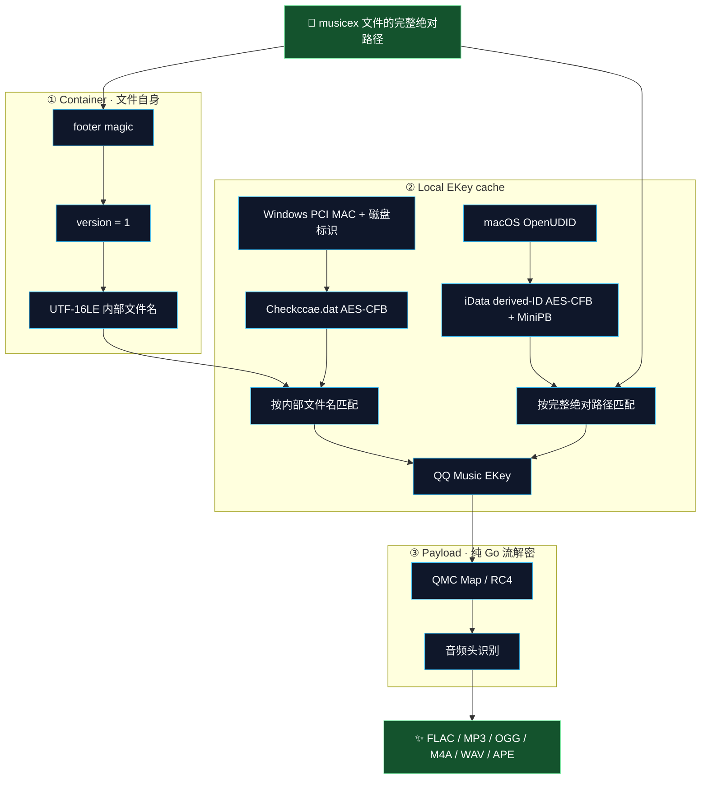
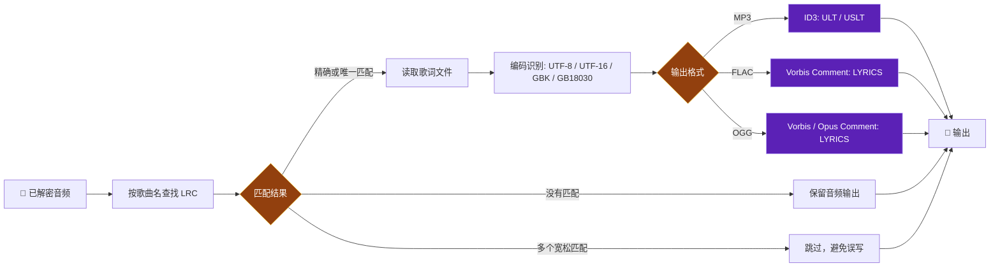
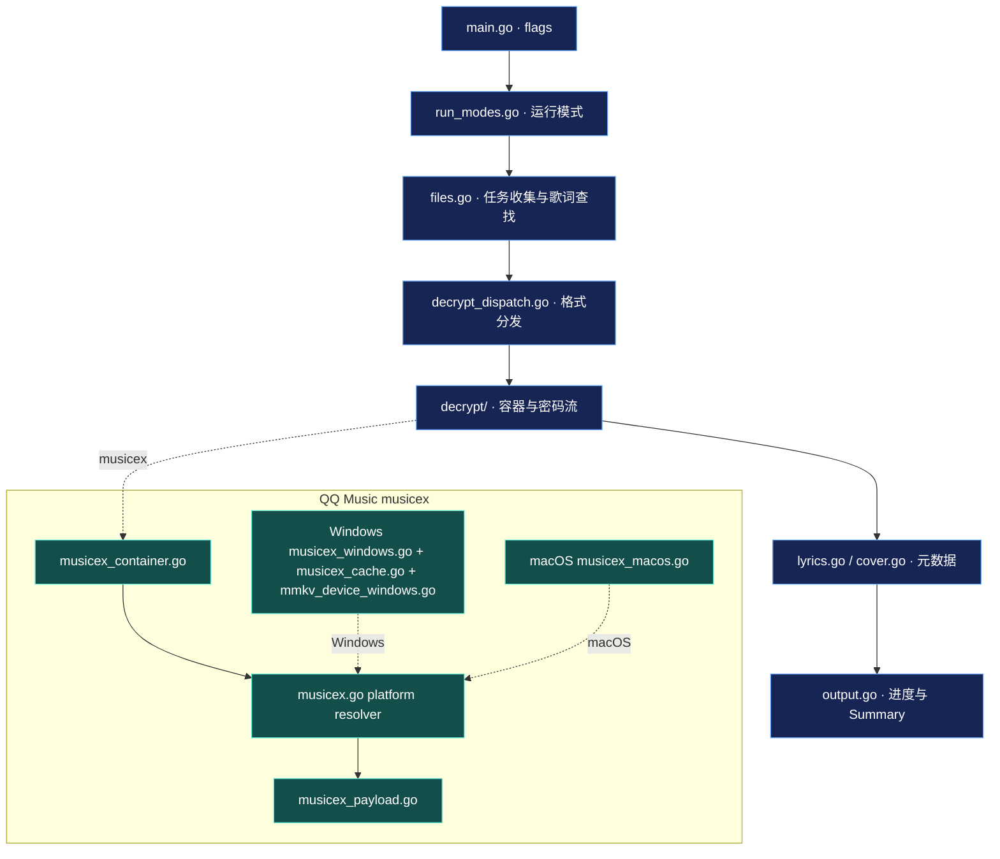

# unlock-music-go

面向 Windows 与 macOS 的 Go 命令行音乐文件解密工具，覆盖网易云、QQ 音乐、酷狗、酷我、喜马拉雅和咪咕的常见加密格式，并支持为 MP3、FLAC、OGG 写入或读取 LRC 歌词标签。

## 特性

- 支持 30+ 种加密文件扩展名。
- 支持 QQ Music desktop 当前 `musicex` 下载格式，完整链路为纯 Go。
- 本项目的新版 `musicex` payload 解密不加载 `CommonFunction.dll`，也不依赖 QQ Music 安装目录。
- Windows 自动读取本机 `%APPDATA%\Tencent\QQMusic\Checkccae.dat`；macOS 自动读取 QQMusicMac 容器的 OpenUDID 与加密 MMKV。
- 支持 `-qqmusic-mmkv`、`-qqmusic-mac-data` 指定缓存位置，以及 `-qqmusic-ekey` 直接传入一条 QQ Music EKey。
- 解密时默认匹配 LRC 并写入 MP3 `USLT`、FLAC / OGG `LYRICS` 标签；无匹配文件保持音频输出并在 Summary 汇总。
- NCM 解密会将容器中的封面写回 MP3、FLAC、OGG 输出文件。
- 目录输入会递归处理并保留原始子目录结构；存在失败文件时进程返回码为 `1`。

## 运行总览


## 支持格式

| 服务 / 格式 | 扩展名 |
|---|---|
| 网易云音乐 | `.ncm`、`.uc` |
| QQ 音乐 QMC / musicex | `.mgg`、`.mgg0`、`.mggl`、`.mgg1`、`.mflac`、`.mflac0`、`.mmp4`、`.qmcflac`、`.qmcogg`、`.qmc0`、`.qmc2`、`.qmc3`、`.qmc4`、`.qmc6`、`.qmc8`、`.bkcmp3`、`.bkcm4a`、`.bkcflac`、`.bkcwav`、`.bkcape`、`.bkcogg`、`.bkcwma`、`.tkm`、`.cache`、`.666c6163`、`.6d7033`、`.6f6767`、`.6d3461`、`.776176` |
| QQ 音乐旧版 | `.tm2`、`.tm6` |
| 酷我音乐 | `.kwm` |
| 酷狗音乐 | `.kgm`、`.kgma`、`.vpr` |
| 喜马拉雅 | `.xm`、`.x2m`、`.x3m` |
| 咪咕音乐 | `.mg3d` |

输出扩展名由解密后的音频头自动识别，通常为 MP3、FLAC、OGG、M4A、WAV 或 APE。

## QQ Music `musicex`

当前 QQ Music desktop 下载文件在尾部带有 16 字节 footer：

```text
0x00..0x03  uint32 LE  footer length
0x04..0x07  uint32 LE  version（当前支持 1）
0x08..0x0F  ASCII      "musicex\\0"
```

检测到 footer magic 后，程序会校验 `version=1`、footer 长度及内嵌 UTF-16LE 文件名；新版本容器保持在版本校验路径中，不会进入旧 QMC 分支。

### 解密链路



| 环节 | Windows x64 | macOS arm64（x86_64 可构建） |
|---|---:|---:|
| `musicex` footer / `version=1` 校验 | ✓ | ✓ |
| 本地 EKey cache 推导 | PCI MAC + 磁盘标识 | OpenUDID + 固定索引 `1` |
| MMKV 读取 | `Checkccae.dat` / AES-CFB | `iData/<derived-ID>` / AES-CFB + MiniPB |
| QMC Map/RC4 payload 流解密 | ✓ | ✓ |
| QQ Music DLL / 安装目录 | 无需 | 无需 |

`Checkccae.dat` 保存下载记录中的 EncV2 ekey，且由下载机器的 device key 保护。自动读取模式使用该缓存对应的 Windows 机器硬件标识：PCI 网卡 MAC、首个可读取的物理磁盘序列号、型号、固件版本。当前实现按内部名附近的记录选择 EKey；单条 EKey cache 使用无歧义回退。

默认缓存位置：

```text
%APPDATA%\Tencent\QQMusic\Checkccae.dat
```

非默认位置使用 `-qqmusic-mmkv` 指定。

### macOS 本地 EKey 缓存

macOS 默认 QQMusicMac Application Support 目录：

```text
~/Library/Containers/com.tencent.QQMusicMac/Data/Library/Application Support/QQMusicMac
```

常规/旧安装形态也会回退尝试 `~/Library/Application Support/QQMusicMac`。EKey store 是
`iData/<derived-ID>`（当前验证样本为 `0574jih`）；偏好文件中的 `OpenUDID:OpenUDID`
派生 AES key。`SetupHelper rAudioLog:` 以加密文件的**完整绝对路径**作为 MMKV key，
自动解析以下载时的完整绝对路径定位记录；处理已移动副本时，可在原始 `iQmc` 路径执行，或通过
`-qqmusic-ekey` 传入对应 EKey。非默认 QQMusicMac Application Support 目录使用
`-qqmusic-mac-data` 指定。

#### macOS `SetupHelper` EKey 还原（11.7.0）

`QMLocalAudioDataProvider` 先调用 `QMStreamEncrypt initWithFilePath:` 读取旧式尾部 EKey；
当前 `musicex` v1 文件没有该尾部时，会走 `SetupHelper rAudioLog(filePath)`，并把返回值交给
`QMStreamEncrypt initWithEKey:`。`rAudioLog:` 实际读取第二个 `QMPDBCacheManager`（`i=1`）：

```text
U        = Preferences/com.tencent.QQMusicMac.plist 的 OpenUDID:OpenUDID
rot(U,n) = 字母/数字各自循环加 n
id       = rot(U, 4)[: 5 + ((hex(U[5:7]) + 1) mod 4)]
enKey    = lowerhex(MD5(U + "a547"))
data     = iData/<id>
iv       = data.crc[12:28]
payload  = AES-128-CFB-Decrypt(key=enKey[:16] 的 ASCII, iv, data[4:4+u32le(data[0:4])])
MiniPB   = root varint 后的 path/value 记录；value 再以一层 varint 长度包装 364/704 字符 Base64 EKey
```

当前验证样本的 `id` 为 `0574jih`。解出 EKey 后，后续仍复用通用的 EncV2 → QMC Map/RC4
payload 流解密；本项目没有调用 QQ Music DLL。

原生客户端还会通过 `music.vkey.GetEVkey` / `GetEDownUrl` 向内存 EKey cache 补源；本 CLI 的自动路径覆盖本地 MMKV，并支持 `-qqmusic-ekey` 传入对应 key。

### 已验证的 QQ Music desktop 版本

| 平台 | QQ Music 版本 | 下载类型 | 验证状态 |
|---|---|---|---|
| Windows x64 | `22.4.1` | 当前 `musicex` 容器 + `Checkccae.dat` | 已完成解密验证 |
| macOS | `11.7.0`（build `73272`） | `musicex` v1 + `SetupHelper` MMKV EKey | 已完成本机端到端 FLAC 验证 |
| Windows | `19.51.0.0` | 旧版 QMC 下载链路 | 已完成旧版格式验证 |

客户端更新可能改变容器、缓存或 key 派生行为。遇到新的格式版本时，应先使用表中的已验证版本复现并检查 footer、缓存记录和输出音频头。

### 保留旧版 19.51.0.0

旧版 QQ Music 可能在启动后调用安装目录中的 `QQMusicUp.exe` 执行升级。为了保留 `19.51.0.0` 验证环境，可先关闭 QQ Music 并备份原 `QQMusicUp.exe`，然后创建一个空白文本文件，将文件名改为 `QQMusicUp.exe`，再放入 QQ Music 安装目录替换同名升级器。需要恢复客户端升级时，将备份的原文件还原即可。

## 维护范围

QQ Music 是当前唯一持续维护的解密模块。网易云、酷狗、酷我、喜马拉雅、咪咕及其他平台的既有解密实现保持当前状态，不再跟进新格式、客户端版本兼容或算法变动；对应功能仍可按现有支持格式使用。

## 构建

要求 Go 1.25+。Windows `musicex` 自动模式需要 Windows x64，以调用网络、注册表、物理磁盘 API 派生 `Checkccae.dat` 的 device key；macOS 自动模式读取本机 QQMusicMac 的 OpenUDID 与 MMKV。

```powershell
git clone git@github.com:DearZL/unlock-music-go.git
Set-Location unlock-music-go
$env:GOOS = 'windows'
$env:GOARCH = 'amd64'
go build -o .\unlock-music-go.exe .
```

macOS 可直接构建：

```bash
go build -o unlock-music-go .
```

Windows 构建产物为 `unlock-music-go.exe`；macOS 构建产物为 `unlock-music-go`。

## 使用

```powershell
.\unlock-music-go.exe -i <文件或目录> [-o <输出目录>] [-with-lyrics=<true|false>] [-lrc-pattern <正则>]
.\unlock-music-go.exe -i <文件或目录> -embed-lyrics [-o <输出目录>] [-lrc-pattern <正则>]
.\unlock-music-go.exe -i <文件.mp3|flac|ogg> -dump-tags
```

| 参数 | 默认值 | 说明 |
|---|---|---|
| `-i` | 必填 | 输入文件或目录；目录递归处理 |
| `-o` | 源文件同目录 | 输出目录；批量任务保留子目录结构 |
| `-with-lyrics` | `true` | 解密后查找同目录 LRC 并写入标签；设为 `false` 时仅输出音频 |
| `-embed-lyrics` | `false` | 仅给已有 MP3 / FLAC / OGG 写入歌词 |
| `-dump-tags` | `false` | 打印 MP3 / FLAC / OGG 内嵌歌词并退出 |
| `-lrc-pattern` | `{name}\.lrc` | 歌词正则模板，`{name}` 代表已转义的歌曲文件名 |
| `-qqmusic-mmkv` | 自动（Windows：`%APPDATA%\Tencent\QQMusic\Checkccae.dat`） | Windows `musicex` 的 `Checkccae.dat` 覆盖路径 |
| `-qqmusic-mac-data` | 自动探测 | macOS `musicex` 的 QQMusicMac Application Support 目录覆盖路径，例如 `.../Data/Library/Application Support/QQMusicMac` |
| `-qqmusic-ekey` | 空 | 直接传入一条 QQ Music EKey，跳过本地 key cache 解析 |

```powershell
# 解密单个 musicex 文件
.\unlock-music-go.exe -i 'D:\Music\song.mflac'

# 递归批量解密
.\unlock-music-go.exe -i 'D:\Music' -o 'D:\Decoded'

# 指定非默认 Checkccae.dat
.\unlock-music-go.exe -i 'D:\Music\song.mflac' `
  -qqmusic-mmkv 'E:\QQMusicData\Checkccae.dat'

# 解密时默认写入同目录匹配到的歌词；缺少 LRC 的文件仍正常输出
.\unlock-music-go.exe -i 'D:\Music' -o 'D:\Decoded'

# 仅解密音频，不查找 LRC
.\unlock-music-go.exe -i 'D:\Music' -o 'D:\Decoded' -with-lyrics=false

# 给明文音频写入歌词；未给 -o 时覆盖源文件
.\unlock-music-go.exe -i 'D:\Music' -embed-lyrics -o 'D:\Tagged'

# 查看已写入的歌词
.\unlock-music-go.exe -i 'D:\Tagged\song.flac' -dump-tags
```

```bash
# macOS：直接解密 QQ Music 本机 iQmc 目录中的 musicex 文件
./unlock-music-go -i "$HOME/Library/Containers/com.tencent.QQMusicMac/Data/Library/Application Support/QQMusicMac/iQmc" -o ./Decoded

# 非默认 QQMusicMac Application Support 目录
./unlock-music-go -i /path/to/song.mflac -qqmusic-mac-data "/path/to/QQMusicMac"
```

### 歌词规则与标签



`-lrc-pattern` 是不区分大小写的 Go 正则模板；`{name}` 替换为歌曲名。解密模式默认启用歌词查找：没有匹配的 LRC 时音频照常写出，Summary 的 `Lyrics` 行会记录 `missing` 数量。多个宽松匹配结果且不存在精确 `歌曲名.lrc` 时，该文件会跳过歌词写入，避免误写其他版本歌词。

| 音频格式 | 写入位置 |
|---|---|
| MP3 | 保留原 ID3v2 主版本：v2.2 `ULT`，v2.3 / v2.4 `USLT` |
| FLAC | Vorbis Comment `LYRICS` |
| OGG（Vorbis / Opus） | Vorbis Comment `LYRICS` |

歌词输入自动识别 UTF-8、UTF-16 LE/BE、GBK、GB18030，并正确处理 UTF-16 代理对。MP3 标签会校验扩展头、footer、同步安全长度与帧边界；FLAC 会校验完整 metadata 链；OGG 会按 logical stream 重组 Vorbis / Opus comment packet，支持与其他流交错的页面。NCM 解密得到的封面会写入 MP3（`APIC` / v2.2 `PIC`）、FLAC（`PICTURE`）、OGG（`METADATA_BLOCK_PICTURE`）。

## 项目架构

```text
unlock-music-go/
├── main.go                 # flag 解析与运行模式入口
├── run_modes.go            # 单文件 / 批量解密、歌词嵌入流程
├── decrypt_dispatch.go     # 扩展名分发；musicex 优先于旧 QMC
├── files.go                # 遍历、歌词查找、输出路径
├── output.go               # 进度、汇总与进程状态
├── encoding.go             # LRC 文本编码识别
├── usage.go                # CLI 帮助
└── decrypt/
    ├── musicex.go           # 新版 musicex 编排
    ├── musicex_container.go # footer、版本、UTF-16LE 内部文件名
    ├── musicex_windows.go   # Windows EKey resolver
    ├── musicex_cache.go     # Windows Checkccae.dat、AES-CFB、EKey 匹配
    ├── musicex_macos.go     # macOS OpenUDID、MMKV、MiniPB EKey resolver
    ├── musicex_unsupported.go # 非 Windows/macOS resolver
    ├── musicex_payload.go   # 纯 Go QMC Map/RC4 payload 解密
    ├── mmkv_device_windows.go # Windows 设备标识与 MMKV key 纯 Go 推导
    ├── qmc.go / qmc_key.go / qmc_cipher.go # QQ QMC 与密钥派生
    ├── ncm*.go              # 网易云解密与缓存
    ├── kgm.go / kwm.go / tm.go / xm.go / ximalaya.go / mg3d.go
    ├── lyrics.go / tags_read.go / cover.go
    └── *_test.go             # 容器、密码流、标签与 device key 测试
```

顶层 `main` 包负责 CLI 与文件任务，`decrypt` 包负责字节级容器、密码、硬件标识和标签处理。`musicex` 按 container、平台 EKey resolver、payload 三层拆分。



### 解密结果示例

```text
  OK    song-a.mflac  →  song-a.flac  [+lrc]
  OK    song-b.mflac  →  song-b.flac

━━━ Summary ━━━━━━━━━━━━━━━━━━━━━━━━━━━━━━━━
  Total   : 2
  Success : 2
  Lyrics  : 1 embedded, 1 missing
━━━━━━━━━━━━━━━━━━━━━━━━━━━━━━━━━━━━━━━━━━━━
```

## 依赖

唯一第三方依赖为 `golang.org/x/text`，用于 GBK / GB18030 歌词解码。其余解密、Windows device key、macOS OpenUDID/MMKV 与标签逻辑均由项目自身代码实现。

## 声明

请遵守音乐平台的服务协议与适用规则，仅处理自己有权访问的文件。
